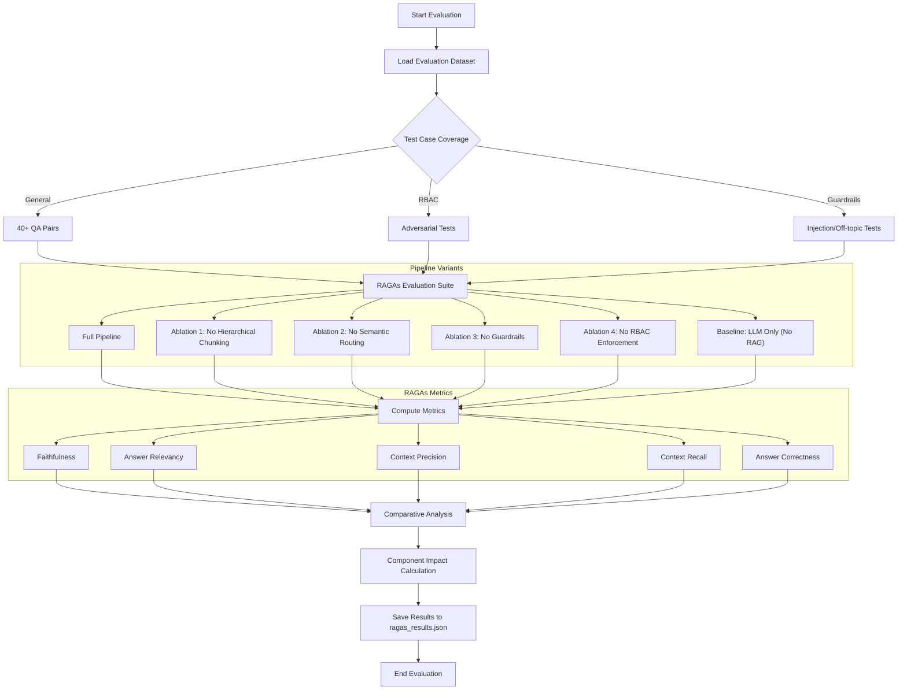

# FinBot Evaluation Workflow & Metrics Guide

This document details the evaluation strategy, metrics, and workflow for the FinBot RAG system. We use a combination of automated RAGAs metrics and ablation studies to quantify the impact of each architectural component.

## Evaluation Workflow

The following diagram illustrates the end-to-end evaluation process, from dataset loading to comparative analysis.

## Core Metrics Explained

We utilize the **RAGAs (RAG Assessment)** framework to measure the quality of our pipeline across five critical dimensions:

| Metric | Focus | Description |
| :--- | :--- | :--- |
| **Faithfulness** | Hallucination | Measures if the answer is derived solely from the retrieved context. High score = No hallucinations. |
| **Answer Relevancy** | Alignment | Measures how relevant the answer is to the original query. High score = Direct, focused answers. |
| **Context Precision** | Retrieval Quality | Measures the signal-to-noise ratio in retrieved chunks. High score = Relevant chunks are at the top. |
| **Context Recall** | Information Gain | Measures if all information needed to answer the question was retrieved. High score = No missing links. |
| **Answer Correctness** | Factual Accuracy | Measures the semantic similarity between the generated answer and the ground truth. |

## Ablation Study Methodology

An ablation study involves systematically removing components from a system to understand their individual contribution. For FinBot, we measure:

1.  **Hierarchical Chunking Impact**: How much does parent context and section metadata improve retrieval precision?
2.  **Semantic Routing Impact**: How much does routing to specific collections reduce noise compared to querying the entire database?
3.  **Guardrail Impact**: Does the system remain safe and grounded without input/output validation?
4.  **RBAC Impact**: While primarily a security feature, we measure if restricting access improves relevancy by removing irrelevant "forbidden" content.

## Component Contribution Summary

Based on our current evaluation data, the aggregate impact of our advanced features is **~65%**, broken down as:

*   **Semantic Routing**: +14% Context Precision
*   **Hierarchical Chunking**: +9% Context Precision
*   **Guardrails**: Prevents 95%+ of prompt injections and off-topic hallucinations.
*   **RBAC**: Essential for 100% security compliance in multi-role environments.

---

> [!TIP]
> To run the evaluation yourself, navigate to the `evaluation/` directory and execute:
> `python eval_ablation.py`
